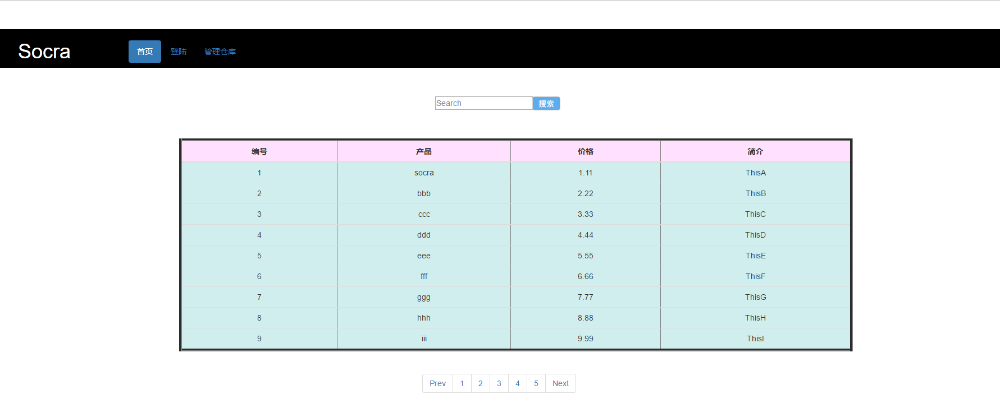

# SocraWeb食用指南

## 项目简介
本项目是基于Servlet+JSP+DataBase实现的一个商品管理系统，主要目的是学习JavaWeb入门的知识：Servlet、JSP以及EL表达式、Ajax和JSON。完成这个项目主要还是巩固练习JavaWeb的基础知识，为后面的JavaEE框架的学习做铺垫。所以以本人的学习经验来看，这是一个很好的上手Web的练习项目


## Github连接
https://github.com/SocraHat/SocraWeb.git

## 环境配置
- MySQL数据库：本人的版本是Server version: 5.7.11 MySQL Community Server (GPL)
- JDK：版本java version "1.8.0_112"
- Tomcat：apache-tomcat-7.0.73
- JDBC-jar包：mysql-connector-java-5.1.40-bin.jar
- JSTL-jar包：jstl.jar
- 开发环境：EclipseEE版本

### 数据库表单创建
- 首先确认连接MySQL数据库的用户名是`root`，密码是`123456`
- 创建名为`web_manage`的数据库
- 再在该数据下创建名为`user`，`manager`，`goods`和`goodsInformation`的四个数据表
- user的SQL语句为：存储注册用户信息
```mysql
CREATE TABLE user(
	uid varchar(16) PRIMARY KEY,
	upsd varchar(16) NOT NULL,
  	uname varchar(16) 
);
```
- manager的SQL语句为：存储管理员信息
```mysql
CREATE TABLE manager(
	mid varchar(16) PRIMARY KEY,
	mpsd varchar(10) ,
  	mname varchar(16) 
);
```
- goods的SQL语句为：存储管理商品的信息
```mysql
CREATE TABLE goods(
	gid int(11) PRIMARY KEY,
	gname varchar(50),
  	gprice float,
  	gintroduce varchar(50),
);
```
- goodsInformation的SQL语句为：商品信息的补充
```mysql
CREATE TABLE goodsInformation(
	gid int(11) PRIMARY KEY,
  	gintroduce varchar(255),
);
```

## 功能
整个项目主要的功能是增删改查
- 用户的注册登陆以及退出
- 主页商品的查看和查询商品
- 用户信息的修改
- 管理员登陆修改自己的信息
- 管理员修改商品信息
- 增加、删除商品信息

## 操作说明
具体的导入工程（Eclipse或者是IDEA）请自行百度，在导入项目后启动Tomcat服务器后就可以直接食用了。
但是有几点需要再注意下
- 用户需要登陆才能查看商品详细信息（权限设置）
- 只有管理员才有权限去更改商品的各个信息
- 可能在程序中设置有session的存活时间，所以长时间不对页面操作而导致登陆状态消失时请重新登录
- 修改商品信息、用户信息、管理员信息时一定注意不能是空值`null`，另外在新增商品时注意商品的编号不能是`0`
- 其余的基本操作可以自己去尝试，和一般的网页处理事务的顺序原理相似

# 项目总结
项目前后历时还是有个个把月的，但主要还是最后的这两天完成实现了大部分功能，虽然只是一个初级的小项目，但是内心还是充满了欢喜的。这部分知识不敢说全部掌握，起码也有个六七八了，后面的细节，再做补充。

## 难点
感觉项目中比较棘手的地方：
- 页面的合理设计：追求一定美观合适，也使用了BootStrap
- 前后台数据的交互：有时需要用到Servlet到JSP或是Servlet的转发，有时需要用到Session，有时需要用到JS的跳转，错综复杂，但是编码问题，调用的方法，需要后续再补充一篇细节总结
- 使用JS来获取页面的表格中的数据并使用Ajax传递到后台
- 登陆后的登出以及验证问题
- 程序和数据库交互问题：如何正确又高效的查询
- 初步尝试MVC（Servlet+JSP+JavaBean）模式，虽然分了层，但是感觉还是不够清晰简洁

# 责任声明
本项目纯属个人项目，因为本人能力问题，可能某些地方的处理不合适或是有误，欢迎大家提出宝贵意见。
若是对您学习造成了误导，本人表示十分抱歉。